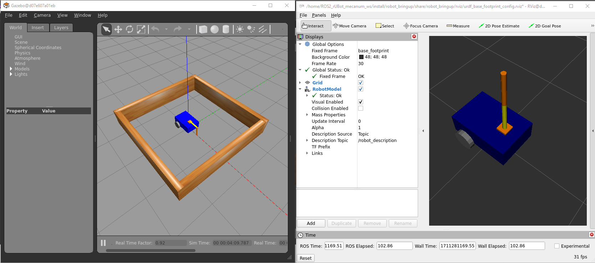
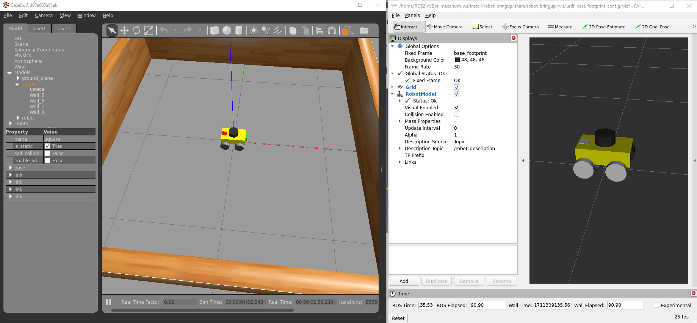

## **2. ROS2 rUBot model and Bringup**
The main objective of this section is to simulate the rUBot behaviour in virtual environment.

The particular objectives of this section are:
- Create a complete robot model of our rUBot Mecanum
- Create a world model of the virtual environment
- Bringup the robot in virtual environment
- Bringup the real robot.

The rUBot mecanum robot we will work is represented in the picture:


A very good guide is described in: https://www.udemy.com/course/ros2-tf-urdf-rviz-gazebo/learn/lecture/38688920#overview

### **2.1. Create a robot model of our rUBot mecanum**

Different robot models have been created to be used in ROS2 Virtual environment:
- Differential-Drive robot
- Mecanum-Drive robot

These 2 kind of robot models can be equipped with a robotic arm:


With 3D custom designed parts (rUBot and Limo robots):


The file format for a robotic model is:
- **URDF** (Unified Robot Description Format): XML-based format to describe the physical configuration of a robot, including its links, joints, and sensors.
- **XACRO** (XML Macros): XML-based, but with macro capabilities for generating URDF files. This format will help you to better organize and scale your model with more functionalities.

We will use GAZEBO, as a physical simulator. The gazebo sensor and actuator functionalities are defined with plugins:
- https://classic.gazebosim.org/tutorials?tut=ros_gzplugins
- https://github.com/ros-simulation/gazebo_ros_pkgs/tree/ros2/gazebo_plugins/include/gazebo_plugins


You can use also any urdf robot model. For exemple our rubot_mecanum.urdf

The only steps to do are:
- write this name in the "urdf_path"
- compile again 
- source the setup.bash


>**Important**: In urdf file, the path to stl files has to be specified with:
````xml
<mesh filename="file://$(find my_robot_description)/meshes/base_link.stl" scale="0.001 0.001 0.001"/>
````

**Gazebo plugins**: 

You need to install the gazebo plugins to properly interact with the sensors and actuators:
```shell
sudo apt update
sudo apt install ros-humble-gazebo-ros-pkgs
```
In ROS2 the gazebo plugins have changed and you have to see the available ones (with the syntax exemple) in: https://github.com/ros-simulation/gazebo_ros_pkgs/tree/ros2/gazebo_plugins/include/gazebo_plugins

### **2.3. Create a new robot_bringup package**

This is usually made to spawn the robot model in a proper virtual world in gazebo environment.

Let's follow similar steps as previous section for robot_description package:
- Create a new package:
```shell
ros2 pkg create my_robot_bringup
```
- remove "src" and "include" folders
- add "launch" "rviz" "worlds" folders
- Install the folders modifying the "CMakeList.txt" file:
```shell
cmake_minimum_required(VERSION 3.8)
project(robot_bringup)

if(CMAKE_COMPILER_IS_GNUCXX OR CMAKE_CXX_COMPILER_ID MATCHES "Clang")
  add_compile_options(-Wall -Wextra -Wpedantic)
endif()

# find dependencies
find_package(ament_cmake REQUIRED)

install(
  DIRECTORY launch rviz worlds
  DESTINATION share/${PROJECT_NAME}/
)

ament_package()
```

- create a new "my_robot_gazebo.launch.xml"
```xml
<launch>
     <let name="x0" value="0.5"/>
     <let name="y0" value="0.5"/>
     <let name="yaw0" value="1.57"/>

    <let name="urdf_path" 
         value="$(find-pkg-share my_robot_description)/urdf/my_mecanum_robot.urdf.xacro" />
    <let name="rviz_config_path"
         value="$(find-pkg-share my_robot_bringup)/rviz/urdf_config.rviz" />

    <node pkg="robot_state_publisher" exec="robot_state_publisher">
        <param name="robot_description"
               value="$(command 'xacro $(var urdf_path)')" />
    </node>

    <include file="$(find-pkg-share gazebo_ros)/launch/gazebo.launch.py">
     <arg name="world" value="$(find-pkg-share my_robot_bringup)/worlds/square2.world" />
    </include>

    <node pkg="gazebo_ros" exec="spawn_entity.py"
          args="-topic robot_description -entity my_robot -x $(var x0) -y $(var y0) -Y $(var yaw0)" />

    <node pkg="rviz2" exec="rviz2" output="screen" 
          args="-d $(var rviz_config_path)" />
</launch>
```
- Because of we have used other packages, these have to be included in "package.xml" file:

```xml
  <buildtool_depend>ament_cmake</buildtool_depend>

  <exec_depend>robot_description</exec_depend>
  <exec_depend>robot_state_publisher</exec_depend>
  <exec_depend>joint_state_publisher</exec_depend>
  <exec_depend>rviz2</exec_depend>
  <exec_depend>ros2launch</exec_depend>
  <exec_depend>gazebo_ros</exec_depend>

  <test_depend>ament_lint_auto</test_depend>
```
- Now you can compile again
```shell
colcon build
```
You can now bringup your robot in the designed world
```shell
ros2 launch my_robot_bringup my_robot_gazebo.launch.xml
```



I can use also the rUBot custom model. In ROS2 is reccomended not to use 3D files and use simple geometries instead (Box, Cylinder and sphere) for computing simplicity.

```shell
ros2 launch my_robot_bringup my_robot_gazebo.launch.xml
```


> Be careful to write the entity name in launch file corresponding to the one defined in urdf model ("rubot" in this case)

**Activity:**

Bringup your rUBot model within the real custom designed World

### **2.4. First driving Control**

The objective here is only to verify that the robot is correcly bringup and we can control it using the "teleop-twist-keyboard" package.

- Install the "teleop-twist-keyboard" package.
```shell
sudo apt update
sudo apt install ros-humble-teleop-twist-keyboard
```
- Bringup our robot in Gazebo virtual environment
```shell
ros2 launch my_robot_bringup my_robot_gazebo.launch.xml
```
- Launch the teleop-twist-keyboard:
```shell
ros2 run teleop_twist_keyboard teleop_twist_keyboard
```
- open a new terminal and listen the /odom topic
```shell
ros2 topic echo /odom
```
- Print the Nodes and topics using rqt_graph


