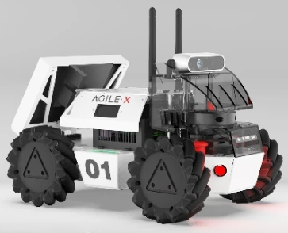

# **3. ROS2 rUBot Mecanum Control**

The objectives of this chapter are:
- control in virtual environment 
- control with real robot

We have created different activities in this section:
- Robot performances
    - Keyboard control
    - Python programming control
- Autonomous control with obstacle avoidance
- Robot Wall follower

The final model represents the real robots we will use in the laboratory:
- rUBot mecanum custom made robot
- LIMO commercial mecanum robot


|  |  |
|:--:|:--:|
| **rUBot** | **LIMO** |

**Bibliography:**
- TheConstruct: Build Your First ROS2 Based Robot https://www.robotigniteacademy.com/courses/309
- LIMO repository: https://github.com/agilexrobotics/limo_ros2/tree/humble
- LIMO Doc: https://github.com/agilexrobotics/limo_pro_doc/blob/master/Limo%20Pro%20Ros2%20Foxy%20user%20manual(EN).md


## **3.1. Robot performances**

We will need to create a new package. This is already done, but if you want to do it from scratch:
```shell
ros2 pkg create --build-type ament_python my_robot_control --dependencies rclpy std_msgs sensor_msgs geometry_msgs nav_msgs
cd ..
colcon build
```

### **1.1. Kinematics model of mecanum robot**
The rUBot mecanum is based on a 4-wheels and has a Mecanum-drive kinematics model. We have first to analyse its kinematics model to properly control it.

Wheeled mobile robots may be classified in two major categories, holonomic (omnidirectional) and nonholonomic. 
- **Nonholonomic mobile robots**, such as conventional cars, employ conventional wheels, which prevents cars from moving directly sideways.
- **Holonomic mobile robots**, such as mecanum cars, employ omni or mecanum wheels, which allow lateral and diagonal movements

The rUBot mecanum corresponds to a Kinematic model for Holonomic Mecanum wheeled robot:

Omnidirectional wheeled mobile robots typically employ either omni wheels or mecanum wheels, which are typical wheels augmented with rollers on their outer circumference. These rollers spin freely and they allow sideways sliding while the wheel drives forward or backward without slip in that direction.

The **different movements** our car can perform are:


The **forces** involved define the robot linear and angular movement:


The **Forward Kinematics** equations are defined below:


where

- Vi: Linear speed of the wheels.
- ωdi: Angular speed of the wheels.
- Vir: Tangential speed of the rollers.
- ul: Linear velocity of the system on the X axis.
- uf: Linear velocity of the system on the Y axis.
- ω: Speed of rotation of the system on the Z axis.
- a: Distance from the center of the robot to the axis of rotation of the wheel.
- b: Distance from the center of the robot to the center of the width of the wheel.

>(see [Lynch & Park, 2017] for a complete derivation of this model).

In the **Inverse Kinematics** we want to apply a robot movement defined by:
- a linear and angular velocity using a Twist message type published in a /cmd_vel topic. 
- we need to calculate the 4 wheel speeds needed to obtain this robot velocity

This is defined by the following expressions:


To obtain the **Odometry** we use the information of (uf,ul,w) and Gazebo plugin calculates the POSE of our robot.

The analytical expressions are explained graphically in the picture:


In the case of real mecanum robot this is calculated by the robot driver as an arduino program in arduino-mega platform.

### **1.2. Robot control**

We will first drive the robot with speciffic Twist message.

We can control the movement of our robot programatically in python creating a "/my_robot_control_node" node

We will do it first in virtual environment and later with the real robot.

**Virtual environment**

A first simple control program is created to move the robot according to a speciffic Twist message.

- We first bringup our robot (rubot/rubot_mecanum.urdf) in a speciffic world on a desired POSE:
```shell
ros2 launch my_robot_bringup my_robot_bringup_sw.launch.xml use_sim_time:=True x0:=1.0 y0:=1.0 yaw0:=1.8 robot:=rubot/rubot_mecanum.urdf custom_world:=square3m_walls.world
```


A first simple navigation program is created to move the robot according to a speciffic Twist message.

- We will create now a first robot control python file "my_robot_control.py" to define a rubot movement with linear and angular speed during a time td
- Because we will use parameters, review in the file:
    - Declare Parametes
    - Get Parameters
- We have to add in "setup.py" the entry point corresponding to the created node 

```python
    entry_points={
        'console_scripts': [
            'my_robot_control_exec = my_robot_control.my_robot_control:main',
        ],
    },
```
- Create "launch" folder
- Install the launch and config folders modifying the "setup.py" file
- Add dependency on the ros2launch package in "package.xml":
```shell
<exec_depend>ros2launch</exec_depend>
```
- Create specific launch file "my_robot_control.launch.xml" or "my_robot_control.launch.py" to launch the node and python file created above
- The parameter values can be updated:
    - In the node with the "declare parameter"
    - In the launch file with the parameter values
- Compile again and execute:
```
ros2 launch my_robot_control my_robot_control.launch.xml
```
**Real robot**

The same simple control program created in virtual environment to move the robot is used for the real robot.

- We first bringup our real LIMO robot:
    ```shell
    ros2 launch limo_bringup limo_start.launch.py
    ```
- Or bringup the rUBot mecanum robot:
    ``` shell
    ros2 launch my_robot_bringup my_robot_bringup_hw_pi.launch.xml
    ```

    

    >**Important!**: If you are using the RRL service from TheConstruct, the bringup is already done on boot! You have only to connect to the Real Robot.
- We control the robot with the same node created for virtual environment:
    ``` shell
    ros2 launch my_robot_control my_robot_control.launch.xml
    ```

## **2. Driving self-control**

We will use now the created world to test the autonomous navigation with obstacle avoidance performance. 

The algorithm description functionality, created in "my_robot_selfcontrol.py" file,is:
- The created node makes the robot go forward.
    - LIDAR is allways searching the closest distance and the angle
    - when this distance is lower than a threshold, the robot goes backward with angular speed in the oposite direction of the minimum distance angle.

Let's verify first this behaviour in virtual environment

**VIRTUAL environment**

We have to launch the "my_robot_selfcontrol.launch.xml" file in the "my_robot_control" package.
```shell
ros2 launch my_robot_bringup my_robot_bringup_sw.launch.xml use_sim_time:=True x0:=1.0 y0:=1.0 yaw0:=1.8 robot:=rubot/rubot_mecanum.urdf custom_world:=square3m_walls.world
ros2 launch my_robot_control my_robot_selfcontrol.launch.xml
```

>- Verify in rviz if you have to change the fixed frame to "odom" frame
>- You can test the behaviour when tunning the parameters defined

**Activity: rUBot self-control**

The objective of this activity is to modify the code to move the robot in Holonomic way, for exemple:
-  When the minimum distance is in the right side move the robot over the left side

Design the code using the Holonomic robot performances, and upload:
- the file "my_robot_selfcontrol_holonomic.py"
- a video of the current behaviour in your designed world

**REAL robot**

We have to launch the same "my_robot_selfcontrol.launch.xml" file designed for Virtual environment.
```shell
ros2 launch my_robot_control my_robot_selfcontrol.launch.xml time_to_stop:=10
```
>The robot is not working as expected because the number of laser beams is not 720 as in simulation!

**Lab Activity: Lidar test**

The objectives of this activity are:
- Put your robot inside a real world
- Launch the rubot_lidar_test.launch file and verify:
  - the number of laser beams
  - the angle for the first laser beam index
  - the total laser beams angle range
- Create a new **rubot_lidar_test_custom.launch** and **rubot_lidar_test_custom.py**, including a laser_factor variable as beams/deg.
- Verify the Lidar is able to identify correctly the obstacles in each angle orientation!

Upload a zip file including:
- picture containing:
  - rviz screen where you can see the lidar distances
  - terminal running the "rubot_lidar_test_custom.launch" with distances readings
- the rubot_lidar_test_custom.py

**Lab Activity: rUBot self-control**

The objective of this lab session is:
- take into account the number of laser beams of your Lidar in the python code
- verify the designed holonomic self-control node you have created for virtual environment in the previous activity.

Upload the:
- "my_robot_selfcontrol_holonomic.launch.xml" and "my_robot_selfcontrol_holonomic.py" files
- Video of the execution in REAL environment

## **3. Wall Follower**

We have created a Wall_Follower strategy based on the reading distances from LIDAR in the ranges: front, front-right, right and back-right, and perform a specific actuation in function of the minimum distance readings.

Follow the instructions to create the program is described on: https://www.theconstructsim.com/wall-follower-algorithm/

The algorith is based on laser ranges test and depends on the LIDAR type: 


**VIRTUAL environment**

We have to launch the "my_robot_wallfollower.launch.xml" file in the "my_robot_control" package.
```shell
ros2 launch my_robot_bringup my_robot_bringup_sw.launch.xml use_sim_time:=True x0:=1.0 y0:=1.0 yaw0:=1.8 robot:=rubot/rubot_mecanum.urdf custom_world:=square3m_walls.world
ros2 launch my_robot_control my_robot_wallfollower.launch.xml time_to_stop:=10
```
>- You can test the behaviour when tunning the parameters defined

**Activity: rUBot self-control**

The objective of this activity is to modify the code to move the robot in Holonomic way, for exemple:
-  When the minimum distance is in the right side move the robot over the left side

Design the code using the Holonomic robot performances, and upload:
- the file "my_robot_selfcontrol_holonomic.py"
- a video of the current behaviour in your designed world

**REAL robot**

We have to launch the same "my_robot_selfcontrol.launch.xml" file designed for Virtual environment.
```shell
ros2 launch my_robot_control my_robot_wallfollower.launch.xml
```
>The robot is not working as expected because the number of laser beams is not 720 as in simulation!

**Lab Activity: rUBot self-control**

The objective of this lab session is:
- take into account the number of laser beams of your Lidar in the python code
- verify the designed holonomic self-control node you have created for virtual environment in the previous activity.

Upload the:
- "my_robot_selfcontrol_holonomic.launch.xml" and "my_robot_selfcontrol_holonomic.py" files
- Video of the execution in REAL environment
