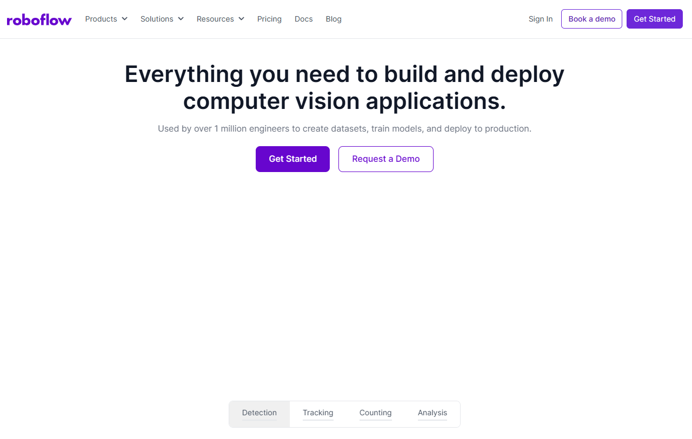

# Project for Traffic Signal Detection with YOLO

We will describe the Computer Vision based method to identify the Traffic Sign.

Training models: 
- https://roboflow.com/
- https://github.com/ultralytics/ultralytics
- https://docs.ultralytics.com/es/usage/python/#how-do-i-train-a-custom-yolo-model-using-my-dataset

For this project we have created a new package "my_robot_ai_identification" where we have used 2 strategies to perform signal identification:
- Keras with tensorflow
- YOLO 

## **1. ROS2 packages installation**

The needed Installation for YOLO identification is only to install "ultralytics" on the ROS2 Humble environment. Open a terminal and type:
````shell
pip install ultralytics
````

## **1. Model Training**

To properly train a model we will use "roboflow":
- Open a new google tab: https://roboflow.com/
    
- Select "Get Started" or "Sign In" and "Continue with Google"
- Select a Name of the workspace (i.e. TrafficSignals)
- Select "Public Plan"
- You will have 2 invites available for your project partners to collaborate in the model generation
- Create a workspace
- Answer some objective questions
- Select "What type of model would you like to deploy?"
- There is a short Roboflow tutorial video: https://blog.roboflow.com/getting-started-with-roboflow/
In roboflow:
- make pictures for each traffic signal
- open Roboflow project
- label all traffic signs pictures
- select % of training (80%) / Validating (15%) / Test (5%)
- Download dataset: signal.yaml file

## **3. Signal prediction**

In TheConstruct,
- Train the model on pre-trained model (i.e. yolov8n.pt) with the custom dataset obtained from Roboflow (i.e. signal.yaml)

````python
# This script demonstrates how to train a YOLOv8n model using the Ultralytics YOLO library.
from ultralytics import YOLO

# Load a pretrained YOLO8n model
model = YOLO("yolov8n.pt")  # Load the YOLOv8n model

# Train the model on the our dataset for 100 epochs
train_results = model.train(
    data="signal.yaml",  # Path to dataset configuration file (Roboflow dataset)
    epochs=20,  # Number of training epochs
    imgsz=640,  # Image size for training
    device="cpu",  # Device to run on (e.g., 'cpu', 0, [0,1,2,3])
)

# Evaluate the model's performance on the validation set
metrics = model.val()

# Perform object detection on an image
results = model("test/images/prohibido.jpg")  # Predict on an image from test set
results[0].show()  # Display results

# Save the model's weights
model.save("yolov8n_custom.pt")  # Save the model with custom weights
# Export the model to ONNX format for deployment
path = model.export(format="onnx")  # Returns the path to the exported model
````
- Make prediction using the saved custom model (i.e. yolov8n_custom.pt)

````python
# This script demonstrates how to train a YOLOv8n model using the Ultralytics YOLO library.
from ultralytics import YOLO

# Load a pretrained YOLO8n model
model = YOLO("yolov8n_custom.pt")  # Load the YOLOv8n model

# Perform object detection on an image
results = model("test/images/prohibido.jpg")  # Predict on an image from test set
results[0].show()  # Display results
````