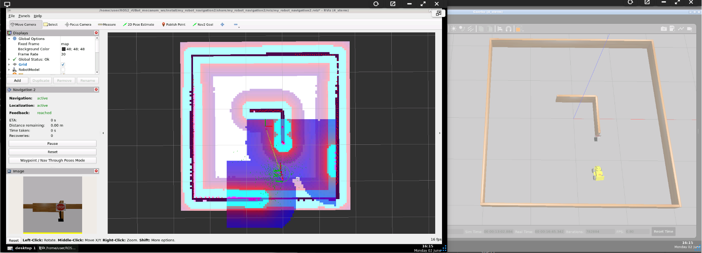
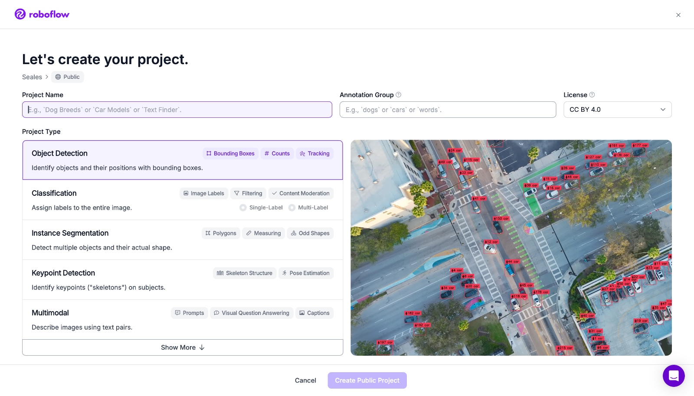
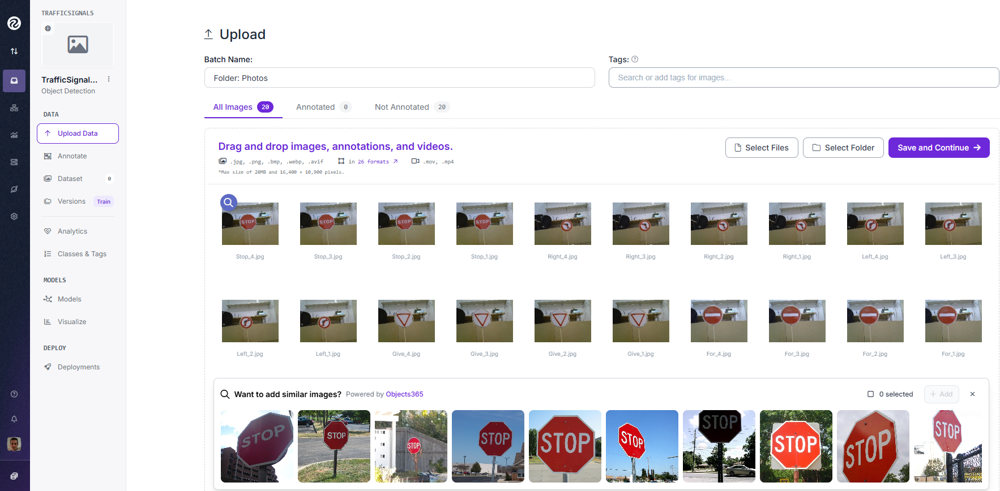
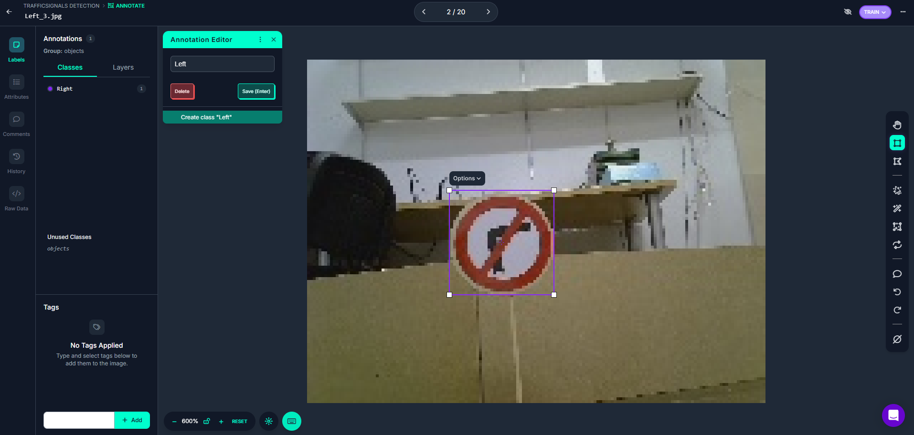
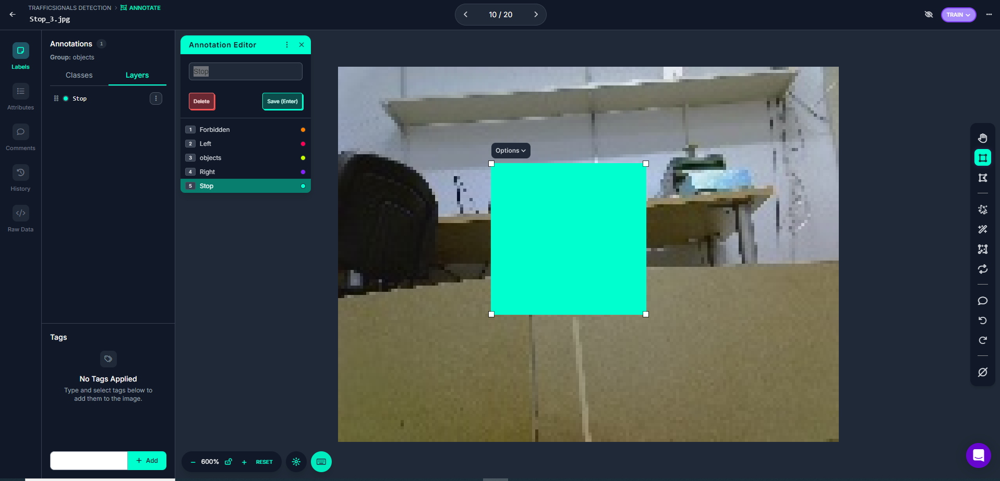
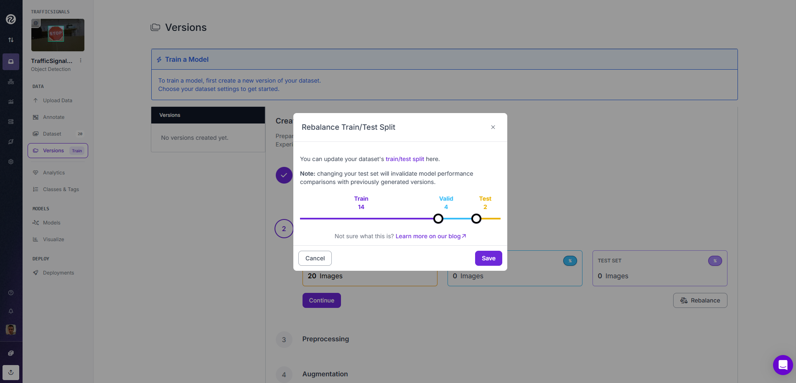
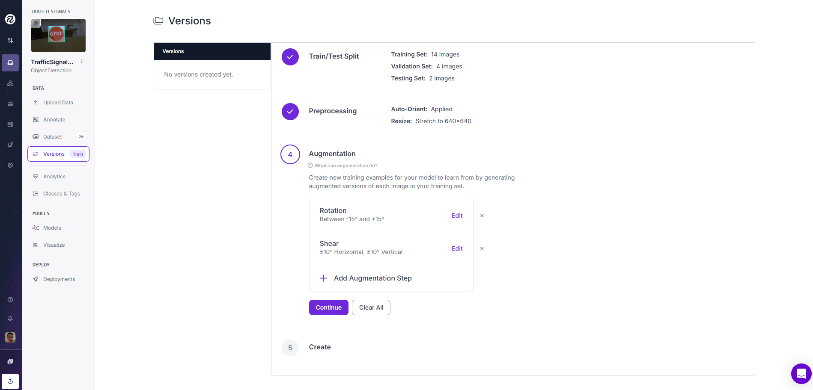
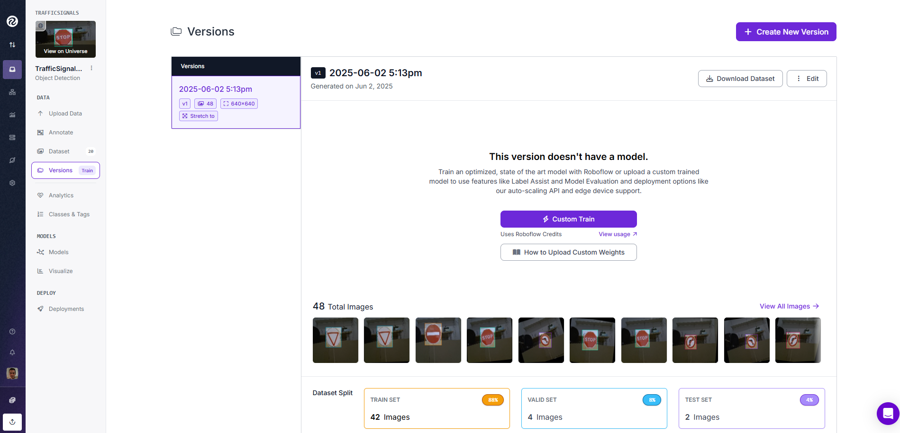
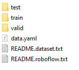
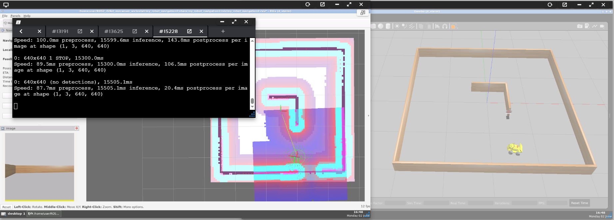

# Project for Traffic Signal Detection with YOLO

We will describe the Computer Vision based method to identify the Traffic Sign.

Training models: 
- https://roboflow.com/
- https://github.com/ultralytics/ultralytics
- https://docs.ultralytics.com/es/usage/python/#how-do-i-train-a-custom-yolo-model-using-my-dataset

For this project we have created a new package "my_robot_ai_identification" where we have used 2 strategies to perform signal identification:
- Keras with tensorflow
- YOLO 

## **1. ROS2 packages installation**

The needed Installation for YOLO identification is only to install "ultralytics" on the ROS2 Humble environment. Open a terminal and type:
````shell
pip install ultralytics
pip3 uninstall numpy
pip3 install "numpy<2.0"
````

## **2. Robot Navigation**

To proceed with the signal identification we first bringup the robot and navigate from initial pose to final target.

- Bringup the robot
    - In simulation:
    ````shell
    ros2 launch my_robot_bringup my_robot_bringup_sw.launch.xml use_sim_time:=True x0:=0.5 y0:=-1.5 yaw0:=1.57 robot:=rubot/rubot_mecanum.urdf custom_world:=square4m_sign.world
    ````
    >Important: Include a traffic signal in the world. When using "square4m_sign.world" you can change the sign model on line 30 changing the traffic sign model name
    - In real robot LIMO the bringup is already made when turned on

- Generate a map
    - In simulation:
    ````shell
    ros2 launch my_robot_cartographer cartographer.launch.py use_sim_time:=True
    ````
    - In real robot LIMO:
    ````shell
    ros2 launch my_robot_cartographer cartographer.launch.py use_sim_time:=False
    ````
    - Save the map in my_robot_navigation2/map folder with:
    ````shell
    cd src/Navigation_Projects/my_robot_navigation2/map/
    ros2 run nav2_map_server map_saver_cli -f my_map_yolo
    ````
- Navigate using the Map:
    - In simulation:
        ````bash
        ros2 launch my_robot_navigation2 navigation2_robot.launch.py use_sim_time:=True map:=map_square4m_sign.yaml param:=limo_sw.yaml
        ````
        >For LIMO: We use "limo_sw.yaml" file. In case we want to priorize the lidar data from odometry data we will use Limo_sw_lidar.yaml

        
    - In the case of real robot:
        - Because the bringup is done without the LIMO robot model. The only frames available are
            - odom: as a ``base_frame_id``
            - base_link: as the ``robot_base_frame``
        - We have to create "LIMO_real.yaml" file in "param" folder correcting base_frame_id: "odom" (instead of base_footprint)
        ````shell
        ros2 launch my_robot_navigation2 navigation2_robot.launch.py use_sim_time:=False map:=map_square4m_sign.yaml param:=limo_real.yaml
        ````

## **3. Model Training**

To properly train a model we will use "roboflow":
- Open a new google tab: https://roboflow.com/
    
- Select "Get Started" or "Sign In" and "Continue with Google"
- Select a Name of the workspace (i.e. TrafficSignals)
- Select "Public Plan"
- You will have a maximum of 4 invites available for your project partners to collaborate in the model generation. We suggest a role of "Admin" for Invite team members
- Create a workspace
- Answer some objective questions
- Select "What type of model would you like to deploy?". Type "Object Detection"
    
- There is a short Roboflow tutorial video: https://blog.roboflow.com/getting-started-with-roboflow/

- Create a project in our created "Workspace":
    - Select Projects and choose ``new project``
        
    - Upload all the images on this project (stop, right, left, give, etc)
        
    - Type ``save&continue`` and ``start labeling`` to label all traffic signs pictures
    - You can assign some pictures to different Invited team members
    - Select ``start anotating``
        
    - If you make an error, type ``layers`` 3point menu and change class
        
    - When finished go back (left corner arrow) and select ``add xx images to Dataset``.
    - Select Method ``use existing values`` and press ``add images``
    - Select ``train model`` and ``custom training``
    - Edit ``train test/split`` select ``balance`` (select % of training (80%) / Validating (15%) / Test (5%))
        
    - select ``continue`` for the other options
    - select ``augmentation`` and ``shear`` to proper consider rotations in x and y axis
        
    - type ``create``
    - type ``download Data set`` choose format ``yolov8`` and ``Download zip to computer``. Save this zip file to your computer. This contains images (for train, valid and test) and data.yaml used in the next section to obtain the final model.

    


## **4. Signal prediction**

In TheConstruct environment
- Train the model on pre-trained model (i.e. yolov8n.pt) with the custom dataset obtained from Roboflow (i.e. data.yaml). The suggested value for "epochs=100" to obtain a more accurate model. This program performs:
    - Generates a model "yolo8n_custom.pt"
    - Evaluates the model performances
    - makes a prediction for a speciffic test image in the corresponding folder from zip file
    - save the model to be used in the next section for real time prediction

    ````python
    # This script demonstrates how to train a YOLOv8n model using the Ultralytics YOLO library.
    from ultralytics import YOLO

    # Load a pretrained YOLO8n model
    model = YOLO("yolov8n.pt")  # Load the YOLOv8n model

    # Train the model on the our dataset for 100 epochs
    train_results = model.train(
        data="data.yaml",  # Path to dataset configuration file (Roboflow dataset)
        epochs=20,  # Number of training epochs
        imgsz=640,  # Image size for training
        device="cpu",  # Device to run on (e.g., 'cpu', 0, [0,1,2,3])
    )

    # Evaluate the model's performance on the validation set
    metrics = model.val()

    # Perform object detection on an image
    results = model("test/images/prohibido.jpg")  # Predict on an image from test set
    results[0].show()  # Display results

    # Save the model's weights
    model.save("yolov8n_custom.pt")  # Save the model with custom weights
    # Export the model to ONNX format for deployment
    path = model.export(format="onnx")  # Returns the path to the exported model
    ````
- Make prediction using the saved custom model (i.e. yolov8n_custom.pt)

    ````python
    # This script demonstrates how to train a YOLOv8n model using the Ultralytics YOLO library.
    from ultralytics import YOLO

    # Load a pretrained YOLO8n model
    model = YOLO("yolov8n_custom.pt")  # Load the YOLOv8n model

    # Perform object detection on an image
    results = model("test/images/prohibido.jpg")  # Predict on an image from test set
    results[0].show()  # Display results
    ````
- You can make a prediction of the signal that the robot find on its path to target pose:
    - for 1 test image (use ``picture_prediction_yolo.py``). 
    - for video images from robot camera when moving to target (use ``rt_prediction_yolo.py``)
- **Software** test in Gazebo: 
    - Use the ``rt_prediction_yolo.py`` after the navigation node is launched.
        ````shell
        ros2 run my_robot_ai_identification rt_prediction_yolo_exec
        ````
        > You have to change the model path to '/home/user/ROS2_rUBot_mecanum_ws/src/AI_Projects/my_robot_ai_identification/models/yolov8n_custom.pt

    - To see the image with prediction on RVIZ2, select a new Image message on topic /inference_result
    
    

- **Hardware** Test in real LIMO robot:
    - You have to install on the Limo robot container:
        ````shell
        apt update
        apt install python3-pip
        pip install ultralytics
        # needed numpy version compatible
        pip3 uninstall numpy
        pip3 install "numpy<2.0"
        #
        apt install git
        git clone https://github.com/manelpuig/ROS2_rUBot_mecanum_ws.git
        source /opt/ros/humble/setup.bash
        apt install python3-colcon-common-extensions
        apt install build-essential
        colcon build
        source install/setup.bash
        ros2 run my_robot_ai_identification rt_prediction_yolo_exec
        ````
    
    - Run The real-time prediction:
        ````shell
        ros2 run my_robot_ai_identification rt_prediction_yolo_exec
        ````
        > You have to change the model path to '/root/ROS2_rUBot_mecanum_ws/src/AI_Projects/my_robot_ai_identification/models/yolov8n_custom.pt

## **5. Robot actuation after prediction**

In TheConstruct environment:
- Once the traffic signal is identified, the robot has to actuate according to the detected traffic signal when its position is close (i.e. 1m) to the signal.
