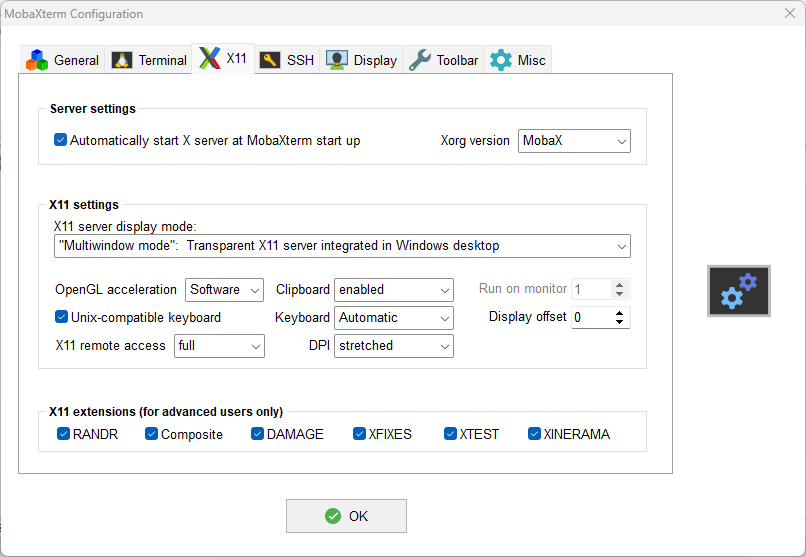

# **PC Workspace setup**

The robots will be connected to internet and we will connect to the robots using a PC/labtop within the same local network

This is the fastest method to connect to my_robot when PC and robot are in the same laboratory connected to a local network within a router.

We will proceed with:
- Install Docker Desktop in the control PC 
- Create a "Docker_PC" folder in your control PC with the contents of "Docker_PC" repository
- A custon ``Dockerfile.pc`` is created for ROS2-Humble environment

## Solution for Windows PC: Unicast

Follow the instructions:
- Create `cyclonedds_robot.xml` file
- Adjust the `docker-compose.yml` with the IP of your PC
- Prepare the `entrypoint.pc.sh` file and make it executable
- Install MobaXterm for ROS graphical display on Windows (https://mobaxterm.mobatek.net/download.html)
  - Configure in Settings to allow full X11 remote access
  
- Obtain the PC-IP and define DISPLAY=192.168.1.6:0.0 to docker-compose or change it later on .bashrc file
- build the container:
  ````shell
  docker compose -f docker-compose.windows.yml up --build -d
  docker exec -it pc-humble bash
  ros2 topic list
  ````
- Complete the .bashrc file with:
  ````bash
  source /opt/ros/humble/setup.bash
  source /usr/share/colcon_argcomplete/hook/colcon-argcomplete.bash
  export ROS_DOMAIN_ID=0
  export RMW_IMPLEMENTATION=rmw_cyclonedds_cpp
  export DISPLAY=192.168.1.6:0.0
  #export GAZEBO_MODEL_PATH=/home/user/ROS2_rUBot_mecanum_ws/src/my_robot_bringup/models:$GAZEBO_MODEL_PATH
  #source /home/user/ROS2_rUBot_tutorial_ws/install/setup.bash
  #source /home/user/ROS2_rUBot_mecanum_ws/install/setup.bash
  #cd /home/user/ROS2_rUBot_tutorial_ws
  #cd /home/user/ROS2_rUBot_mecanum_ws
  ````
- If I modify something from the docker-compose:
  ````bash
  docker compose -f docker-compose.windows.yml down
  docker compose -f docker-compose.windows.yml up -d
  # If the modification is on Dockerfile
  docker compose -f docker-compose.windows.yml up --build -d
  ````


## Solution for Linux PC: Multicast

Follow the instructions:
- Create `cyclonedds_robot.xml` file
- Adjust the `docker-compose.yml` with the IP of your PC
- Prepare the `entrypoint.pc.sh` file and make it executable
- Allow X11 to the container:
  ````shell
  xhost +local:root
  ````
- build the container and verify:
  ````shell
  docker compose -f docker-compose.linux.yml up --build -d
  docker exec -it pc-humble bash
  ros2 topic list
  ````

## Usual work
- Open VScode in your PC, identify the running containers and Attach a ``VScode Workspace to this Container``
- Verify the `.bashrc`file:
  ````shell
  source /opt/ros/humble/setup.bash
  source /usr/share/colcon_argcomplete/hook/colcon-argcomplete.bash
  export ROS_DOMAIN_ID=0
  export RMW_IMPLEMENTATION=rmw_cyclonedds_cpp
  #export GAZEBO_MODEL_PATH=/home/user/ROS2_rUBot_mecanum_ws/src/my_robot_bringup/models:$GAZEBO_MODEL_PATH
  #source /home/user/ROS2_rUBot_tutorial_ws/install/setup.bash
  #source /home/user/ROS2_rUBot_mecanum_ws/install/setup.bash
  #cd /home/user/ROS2_rUBot_tutorial_ws
  #cd /home/user/ROS2_rUBot_mecanum_ws
````
- Open a new ``terminal`` and type:
  ````shell
  ros2 node list
  ````
- Identify the bringup nodes ready when powering your robot.

You are now ready to control your robot!
